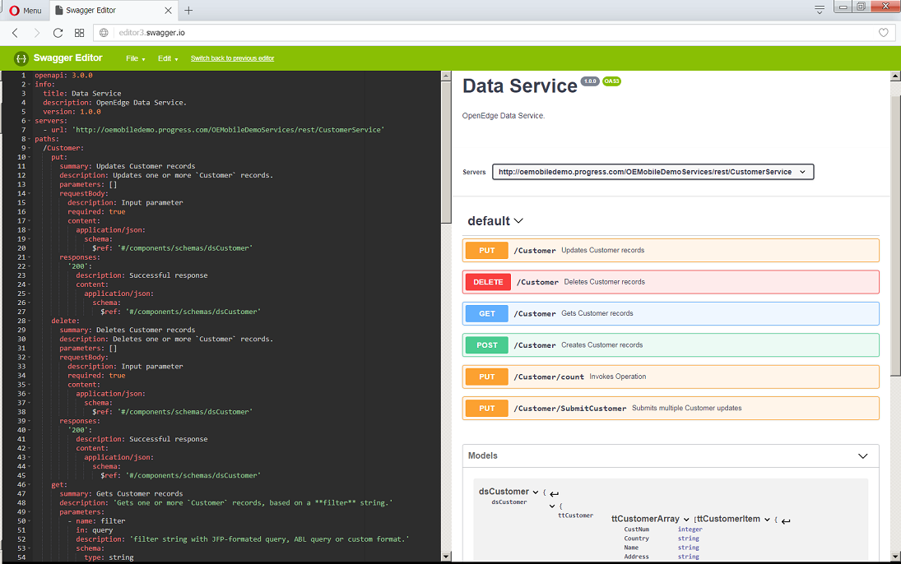

# Sample program to generate an OpenAPI spec file from catalog file

The OpenAPI Specification describes RESTful Web Services. The specification can be used to generate client and server programs as well as documenting the services.

The Data Service Catalog describes the prescriptive REST API in OpenEdge Data Services. This REST API is used by JSDO-based clients to access the OpenEdge backend.

This sample program takes a catalog JSON file as input and generates an OpenAPI Specification file that can be used with related tools such as the Swagger Editor.

Note: Use Progress Developer Studio for OpenEdge to create an OpenEdge Data Service with a catalog file. See the following document for information on how to create one:
* https://community.progress.com/community_groups/openedge_kendo_ui_builder/m/documents/3363

## Requirements
* Recent version of Node.js and NPM

## Installation

```
unzip genoas.zip
cd genoas
npm install
```
## Usage
```
genoas [file | url]
genoas [file | url] [OPTION]... 

OPTIONS:
--host host
--title title
--desc description
--version version
--format ( yaml | json )
--target ( 3.0.0 | 2.0 )
```

## Example
1. Run genoas command for a catalog.json file:
```
genoas http://oemobiledemo.progress.com/OEMobileDemoServices/static/CustomerService.json
genoas http://oemobiledemo.progress.com/OEMobileDemoServices/static/SportsService.json
```
This step generates the specification into a file called oas.yaml.

2. Access Swagger Editor and import the generated oas.yaml file.
3. Review the API and try invoking an operation, for example, a GET operation.

Notes:
* Swagger Editor for OpenAPI 2.0 is available at http://editor2.swagger.io
* The latest Swagger Editor can be run using Docker:
    * https://hub.docker.com/r/swaggerapi/swagger-editor/



## Related links

* OpenAPI Specification and Swagger:
    - https://en.wikipedia.org/wiki/OpenAPI_Specification
    - https://swagger.io/specification/
    - https://swagger.io
    - https://swagger.io/docs/specification/2-0/basic-structure/    
* OpenEdge Data Service:
    - https://community.progress.com/community_groups/openedge_kendo_ui_builder/m/documents/3363
    - https://github.com/CloudDataObject/CDO/blob/master/CloudDataObject_Catalog.pdf
    - https://github.com/CloudDataObject/CDO

## Comments

I don't know who originally created this code, however this is the original source.

https://community.progress.com/s/question/0D54Q00007qckt1SAA/sample-program-to-generate-an-openapi-spec-file-from-a-catalog-file

I have placed the code here to allow for improved access and to permit changes to be tracked and disseminated appropriately.  

Thank you to whoever created this resource, allowing developers to generate OpenAPI clients from Progress JSDO Catalogs.
